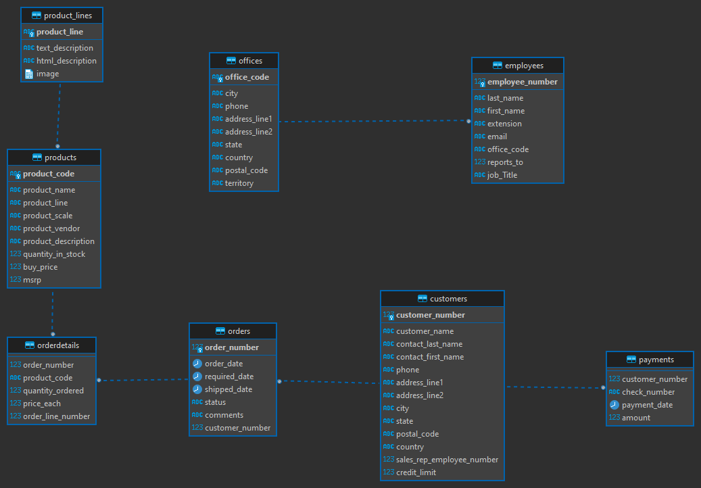

# Case Técnico - Analista de Dados (Python)

## Descrição do Projeto

O projeto consiste em um case técnico para a vaga de Analista de Dados na empresa [Join Tecnologias & Design](https://www.linkedin.com/company/join-ti/). O objetivo é utlilizar a base de dados de um e-commerce - disponível em  [https://uibakery.io/sql-playground](https://uibakery.io/sql-playground) - para realizar algumas ações e responder algumas perguntas, descritas no documento enviado por e-mail, utilizando um notebook do Databricks.

## Diagrama Entidade Relacionamento do Banco Ecommerce



O diagrama acima foi criado utilizando a ferramenta [DBeaver](https://dbeaver.io/).

## Notebook do Databricks

O notebook está disponível no arquivo [Case_Tecnico_Analista_de_Dados.ipynb](Case_Tecnico_Analista_de_Dados.ipynb).

## Etapas do Projeto

### 1. Importar os dados para o Databricks

A importação dos dados foi feita baseada no tutorial da própria documentação oficial da ferramenta [Consultar PostgreSQL com Databricks](https://docs.databricks.com/pt/external-data/postgresql.html). As credenciais de acesso ao banco de dados são disponibilizadas no site de onde a base foi obtida.

Optou-se pela utilização de uma função para importar os dados de cada tabela, pois assim é possível reutilizar o código para importar os dados de outras tabelas:

```python
def get_remote_table(driver: str, url: str, table: str, user: str, password: str) -> DataFrame:
    """
    Lê uma tabela remota utilizando Spark DataFrame API.

    Args:
        driver (str): O driver JDBC para o banco de dados.
        url (str): A URL do banco de dados.
        table (str): O nome da tabela a ser lida.
        user (str): O nome de usuário para autenticação.
        password (str): A senha para autenticação.

    Returns:
        DataFrame: Um DataFrame contendo os dados da tabela remota.
    """
    
    remote_table = (spark.read
                    .format("jdbc")
                    .option("driver", driver)
                    .option("url", url)
                    .option("dbtable", table)
                    .option("user", user)
                    .option("password", password)
                    .load()
                    )
    
    return remote_table
```

Por exemplo, para importar os dados da tabela `product_lines`:

```python
product_lines = get_remote_table(driver=driver, url=url, table='product_lines', user=user, password=password)
```

### 2. Salvar dados das tabelas em arquivos parquet

Para salvar os dados das tabelas em arquivos parquet, utilizou-se a função [`DataFrame.write.parquet()`](https://spark.apache.org/docs/latest/api/python/reference/pyspark.sql/api/pyspark.sql.DataFrameWriter.parquet.html):

```python
# Salvando DataFrame 'product_lines' em Parquet
product_lines.write.parquet("FileStore/CaseTecnico/product_lines.parquet")
```

### 3. Criar merge entre as tabelas do banco de dados e os arquivos parquet

O objetivo do merge consiste em se atualizar os dados dos arquivos parquet com os dados das tabelas vindas do banco de dados, seja inserindo, atualizando ou excluindo registros. Para executar tais ações foi criada a função `merge_data_sources()`:

```python
def merge_data_sources(df_jdbc: DataFrame, df_parquet: DataFrame, key: str, path_to_parquet: str) -> None:
    """
    Realiza a ação de merge entre duas fontes de dados: uma DataFrame da fonte JDBC e outra DataFrame
    dos arquivos Parquet. A função identifica registros a serem inseridos, atualizados e excluídos para
    manter a consistência entre as fontes de dados. Os resultados são salvos como arquivos Parquet.

    Args:
        df_jdbc (DataFrame): DataFrame da fonte JDBC contendo os dados atualizados.
        df_parquet (DataFrame): DataFrame dos arquivos Parquet como fonte de armazenamento local.
        key (str): Nome da coluna que é chave primária para identificação de registros.
        path_to_parquet (str): Caminho para onde os arquivos Parquet atualizados serão salvos.

    Returns:
        None: A função não retorna valor. Os resultados são salvos nos arquivos Parquet especificados.
    """
    # Identificar mudanças entre as fontes de dados
    changes = df_jdbc.subtract(df_parquet)

    # Identificar registros a serem excluídos
    deletes = df_parquet.join(changes, key, "inner")

    # Identificar registros a serem inseridos
    inserts = changes

    # Identificar registros a serem atualizados
    updates = df_jdbc.join(df_parquet.alias("parquet_alias"), key, "inner") \
                     .select("parquet_alias.*")

    # Remover registros a serem excluídos dos arquivos Parquet
    df_updated = df_parquet.join(deletes, key, "left_anti")

    # Adicionar registros a serem inseridos aos arquivos Parquet
    df_updated = df_updated.union(inserts)

    # Atualizar registros a serem atualizados nos arquivos Parquet
    df_updated = df_updated.join(updates, updates.columns, "left_anti")

    # Salvar os resultados de volta como Parquet
    df_updated.write.mode("overwrite").parquet(path_to_parquet)
```

Para exemplificar o uso da função, fez-se as seguintes operações na tabela `product_lines`:

- Inseriu-se um novo registro com `product_line 'Uno com Escada'`;
- Atualizou-se o registro referente ao `product_line 'Vintage Cars'`, alterando o `html_description`;

Para atualizar os dados do arquivo parquet referente à tabela `product_lines`:

```python
# Lendo arquivo Parquet 'product_lines'
product_lines_parquet = spark.read.parquet("/FileStore/CaseTecnico/product_lines.parquet")

# Executando merge entre as fontes de dados
merge_data_sources(
    df_jdbc=product_lines, 
    df_parquet=product_lines_parquet, 
    key="product_line", 
    path_to_parquet="/FileStore/CaseTecnico/product_lines"
)
```

- Antes:

```text
+----------------+--------------------+----------------+-----+
|    product_line|    text_description|html_description|image|
+----------------+--------------------+----------------+-----+
|    Classic Cars|Attention car ent...|            null| null|
|     Motorcycles|Our motorcycles a...|            null| null|
|          Planes|Unique, diecast a...|            null| null|
|           Ships|The perfect holid...|            null| null|
|          Trains|Model trains are ...|            null| null|
|Trucks and Buses|The Truck and Bus...|            null| null|
|    Vintage Cars|Our Vintage Car m...|            null| null|
+----------------+--------------------+----------------+-----+
```

- Depois:

```text
+----------------+--------------------+--------------------+-----+
|    product_line|    text_description|    html_description|image|
+----------------+--------------------+--------------------+-----+
|     Motorcycles|Our motorcycles a...|                null| null|
|           Ships|The perfect holid...|                null| null|
|Trucks and Buses|The Truck and Bus...|                null| null|
|    Classic Cars|Attention car ent...|                null| null|
|          Trains|Model trains are ...|                null| null|
|          Planes|Unique, diecast a...|                null| null|
|  Uno com Escada|A cada dia cresce...|                null| null|
|    Vintage Cars|Our Vintage Car m...|https://www.pexel...| null|
+----------------+--------------------+--------------------+-----+
```

### 4. Responder as perguntas do case

#### 4.1. Qual país possui a maior quantidade de itens cancelados?

**Resposta**: `Nova Zelândia`

```text
+-----------+-----+
|    country|count|
+-----------+-----+
|New Zealand|    2|
+-----------+-----+
```

#### 4.2. Qual o faturamento da linha de produto mais vendido? Considerando os itens *Shipped* cujos pedidos foram realizados no ano de 2005

**Resposta**: `U$ 603.666,99`

```text
+------------+---------+
|product_line|  revenue|
+------------+---------+
|Classic Cars|603666.99|
+------------+---------+
```

#### 4.3. Nome, sobrenome e e-mail dos vendedores do Japão, o local-part do e-mail deve estar mascarado

```text
+----------+---------+---------------------------+
|first_name|last_name|                     e-mail|
+----------+---------+---------------------------+
|      Mami|    Nishi|m****i@classicmodelcars.com|
|   Yoshimi|     Kato| y***o@classicmodelcars.com|
+----------+---------+---------------------------+
```
